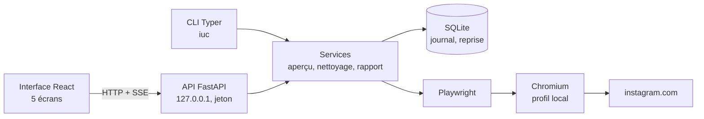

# Instagram Unlike Cleaner : effacer ses « J’aime » Instagram sans confier son compte ?


[](https://github.com/GomuGomuNo01/Instagram-Unlike-Cleaner/actions/workflows/ci.yml?query=branch%3Amain)

Un outil **100 % local** qui retire en masse les likes Instagram, après validation de chaque like
ciblé, **sans jamais voir le mot de passe** : du besoin de l’utilisateur jusqu’à l’interface web,
la ligne de commande et les preuves de sécurité.


| Vous êtes... | Commencez par |
|---|---|
| Recruteur, manager, profil métier | [Partie 1 : l'essentiel en 3 minutes](#partie-1--lessentiel-en-3-minutes) |
| Développeur, profil technique | [Partie 2 : le détail technique](#partie-2--le-détail-technique) |

> **Avertissement** : les conditions d’utilisation d’Instagram **n’autorisent pas
> l’automatisation**. Utiliser IUC expose le compte à un blocage temporaire de certaines actions,
> voire, plus rarement, à une suspension. **Teste d’abord sur un compte secondaire**, avec de
> petits volumes. Retirer un like efface la trace visible, pas ce que l’algorithme a déjà appris.
> IUC est un projet indépendant, sans lien avec Instagram ni Meta.

---

# Partie 1 : l'essentiel en 3 minutes

## Le contexte

Des années de likes Instagram laissent une trace visible, parfois gênante au moment d’une
recherche de stage ou d’emploi. Instagram permet de les retirer, mais à la main, quelques-uns à
la fois. Les outils existants demandent souvent le mot de passe ou envoient les données à un
serveur tiers : on échange un problème de confidentialité contre un autre.

> **Comment retirer des centaines de likes en gardant la main sur chacun, sans confier son
> compte ni ses données à personne ?**

## Ce que j'ai fait

| Étape | En clair |
|---|---|
| 1. Cadrer le besoin et les risques | Aucun mot de passe, tout en local, aperçu obligatoire, cadence prudente, arrêt au moindre signal d’Instagram |
| 2. Valider la faisabilité | Un prototype qui ouvre la page des likes dans un navigateur piloté, la personne s’y connectant elle-même |
| 3. Construire le moteur | Collecte des likes ciblés, retrait par lots contrôlés, journal en base pour reprendre sans rien retraiter |
| 4. Rendre l’outil utilisable | Une interface web en cinq étapes (connexion, critères, aperçu, suivi, rapport) et une ligne de commande |
| 5. Prouver la sécurité | Des tests qui vérifient chaque garantie, une intégration continue et des audits de dépendances |

**Le principe clé : rien n’est retiré sans validation.** Les likes sont ciblés avec le filtre
d’Instagram, exactement celui de sa version web : tri, date de début et date de fin du like. IUC
n’ajoute aucun critère de son cru. Chaque like ciblé est ensuite listé avec son compte et son
type ; la personne décoche ce qu’elle veut garder, puis lance le nettoyage.

## Ce que montrent les essais

**1. L’outil passe à l’échelle d’un vrai historique.** Sur un compte réel, **1 493 likes** ont été
recensés en **14 minutes**, puis des lots ont été retirés à un rythme d’environ **25 likes par
minute**, pauses comprises.

**2. Chaque retrait est vérifié.** Avant de cliquer sur « Je n’aime plus », IUC contrôle que les
cases cochées sont exactement celles du lot prévu ; après, il recharge la page : un like qui
réapparaît est marqué en échec, jamais compté comme retiré.

**3. Le mot de passe ne passe jamais par IUC.** Des tests tapent de faux identifiants dans une
fausse page de connexion puis les cherchent dans tous les fichiers produits : ils n’y sont pas.
Une revue de sécurité a corrigé une fuite possible dans les diagnostics, et un test échoue si la
protection disparaît.

**4. L’outil s’arrête au bon moment.** Déconnexion forcée, vérification de sécurité, message
« Réessayer plus tard » ou interface modifiée : le nettoyage s’arrête aussitôt, passe en pause et
indique la marche à suivre.

| Le filtre d’Instagram, tel quel | Aperçu à cocher |
|---|---|
|  |  |
| **Suivi en direct** | **Rapport final** |
|  |  |

<details>
<summary><b>Voir la page d’accueil et la version mobile</b></summary>


</details>

*Toutes les captures utilisent des comptes fictifs ([`scripts/demo.py`](scripts/demo.py)).*

## Ce que ce projet démontre

- **Sens du besoin** : partir d’une contrainte utilisateur forte (confidentialité) et en faire des
  règles vérifiables, inscrites dans le code et les tests.
- **Rigueur** : chaque action est contrôlée avant et après, chaque résultat est enregistré avant
  la suite, chaque garantie de sécurité a son test.
- **Technique** : automatisation de navigateur, API locale sécurisée, base de données, interface
  web accessible, intégration continue.
- **Communication** : une interface en français, claire, utilisable au clavier et sur mobile, et
  des messages qui disent toujours quoi faire.

## Les limites, en toute transparence

L’outil dépend de l’interface web d’Instagram, qui peut changer ; seule l’interface française est
confirmée ; le ciblage se limite au filtre d’Instagram (tri et dates du like), sans critère par
compte ni par type. Détail en [partie 2](#limites).

---

# Partie 2 : le détail technique

## Sommaire

1. [Architecture](#architecture)
2. [Stack et choix techniques](#stack-et-choix-techniques)
3. [Fonctionnement d'un nettoyage](#fonctionnement-dun-nettoyage)
4. [Sécurité et confidentialité](#sécurité-et-confidentialité)
5. [Tests et validation](#tests-et-validation)
6. [Structure du dépôt](#structure-du-dépôt)
7. [Reproduire le projet](#reproduire-le-projet)
8. [Limites](#limites)
9. [Pistes d'amélioration](#pistes-damélioration)
10. [Documentation](#documentation)
11. [Contribuer, sécurité et licence](#contribuer-sécurité-et-licence)

## Architecture



Un seul navigateur, piloté par Playwright, parle à Instagram ; l’API et la CLI passent par les
mêmes services.

## Stack et choix techniques

| Outil | Usage | Pourquoi ce choix |
|---|---|---|
| **Playwright** (Chromium) | Navigation, lecture de la grille, mode sélection | Profil persistant : la personne se connecte elle-même une fois, la session est reprise ensuite |
| **FastAPI**, Server-Sent Events | API locale, progression en direct | Schémas typés (OpenAPI) partagés avec le frontend ; flux d’événements simple pour le suivi |
| **SQLite**, SQLModel | Nettoyages, likes, journal, compteur quotidien | Une base locale sans serveur ; chaque lot est écrit avant le suivant |
| **Typer** | Ligne de commande `iuc` | Toutes les fonctions sans interface, utiles pour tester et diagnostiquer |
| **React 19**, TypeScript strict, Vite | Interface web | Client d’API typé depuis le schéma OpenAPI ; écrans chargés à la demande |
| **Tailwind CSS 4** | Système de design | Tokens (couleurs, typographie, espacements, motion) vérifiés par un test |
| **pytest, Vitest, Ruff, mypy, Oxlint** | Qualité | Lint, typage strict et tests à chaque modification |
| **GitHub Actions** | Intégration continue | Python 3.11 et 3.14, Chromium sous Linux, audits des dépendances |

## Fonctionnement d'un nettoyage

| Étape | Rôle | Décisions techniques |
|---|---|---|
| Connexion | Fenêtre Chromium dédiée, connexion manuelle | Session reconnue au seul cookie `sessionid` ; aucun champ lu ni rempli |
| Vérification | Ouverture de la page des likes | Chaque élément attendu est cherché ; s’il manque, le message le nomme |
| Critères | Filtre d’Instagram, et lui seul | Tri, date de début et date de fin : IUC remplit le panneau « Trier et filtrer » de la page des likes. L’API refuse tout autre critère plutôt que de l’ignorer |
| Aperçu | Lecture complète de la grille filtrée | Chaque vignette est enregistrée avec son compte et son type, pour décider en connaissance de cause ; publications identifiées par le nom de fichier de leur image (aucun lien dans la grille) |
| Lot | Sélection, « Je n’aime plus », confirmation | Annulation si les cases cochées diffèrent du lot ; seule la fenêtre de confirmation attendue est validée |
| Contrôle | Rechargement de la page | Un like qui réapparaît passe en échec |
| Cadence | Pauses aléatoires, limite quotidienne | Entre deux cases, deux défilements et deux lots ; `DAILY_LIMIT` partagé entre nettoyages |
| Arrêt | Signal d’Instagram ou demande de l’utilisateur | Statut « en pause », reprise sans retraiter |
| Rapport | Bilan, export CSV et JSON | CSV prêt pour Excel (« ; », UTF-8 avec BOM) ; date et heure du retrait en deux colonnes, lisibles sans élargir la colonne |

## Sécurité et confidentialité

Chaque garantie est appliquée dans le code et **prouvée par des tests**
([`test_security.py`](backend/tests/test_security.py), [`test_cleanup.py`](backend/tests/test_cleanup.py)).

| Sujet | Garantie | Preuve |
|---|---|---|
| Identifiants | Aucun champ de connexion lu ni rempli ; aucun mot de passe en mémoire, en base ou dans les journaux. Chromium n’enregistre aucun identifiant ; les diagnostics masquent toute saisie | Analyse du code, identifiants « témoins » cherchés dans tout `DATA_DIR` |
| Données locales | Tout dans `DATA_DIR` ; aucun appel réseau du backend ; CSP de l’interface limitée à l’API locale | Analyse des imports réseau, en-tête CSP, chemins de stockage |
| Suppression | `iuc logout`, `iuc purge` et le bouton « Supprimer mes données locales » | Tests de la CLI, de l’API et du service |
| Cadence | Délais aléatoires, plafond quotidien configurable | Tirages et bornes vérifiés |
| Alertes Instagram | Limite, vérification, déconnexion : arrêt immédiat, en pause, marche à suivre | Fausse page qui déconnecte, vérifie ou limite en plein nettoyage |
| Reprise | Chaque lot enregistré avant le suivant | Interruption, pause, limite puis reprise |
| Changement d’interface | Sélecteurs isolés ([`locators.py`](backend/app/browser/locators.py)), vérification au démarrage | Bouton absent, vignettes illisibles, bouton renommé |
| API locale | 127.0.0.1, jeton par démarrage, contrôle de l’hôte, CORS restreint, en-têtes de sécurité | Tests de l’API et de `iuc serve` |
| Dépendances | Versions figées ([`constraints.txt`](constraints.txt), `package-lock.json`), audits | `pip-audit` et `npm audit` sans vulnérabilité connue |
| Journaux | Aucun nom de compte aimé ni secret ; niveau réglable | Comptes « témoins » cherchés dans le journal |
| Dépôt public | Aucun compte réellement aimé dans les fichiers versionnés | Test de garde sur la base locale |

## Tests et validation

| Niveau | Cible | Outil | Résultat |
|---|---|---|---|
| Unitaires | Filtre d’Instagram, limites quotidiennes, pauses aléatoires, machine d’états, exports | pytest | 227 tests serveur passés |
| Intégration | API et base SQLite, reprise après un arrêt | pytest, httpx | inclus ci-dessus |
| Automatisation | Navigation et retrait sur une fausse page des likes, réseau coupé | Playwright | inclus ci-dessus |
| Frontend | Composants, écran des critères, parcours principal, tokens du système de design | Vitest, Testing Library | 39 tests passés |
| Continu | Lint, typage, tests, audits | GitHub Actions | Python 3.11 et 3.14 |
| Manuel | Un lot réel sur un compte de test | [Recette](docs/recette.md) | 1 493 likes recensés, lots retirés et vérifiés |

La fausse page des likes ([`fake_instagram.py`](backend/tests/fake_instagram.py)) reproduit les
diagnostics réels : paquets de 18 vignettes, mode sélection, fenêtre de confirmation, filtres.

## Structure du dépôt

```
├── backend/app/
│   ├── browser/        Chromium : session, sélecteurs, grille, filtres, mode sélection
│   ├── services/       Aperçu, nettoyage, rapport, données locales
│   ├── api/            API locale (FastAPI) et sécurité
│   ├── core/           Configuration, base, journaux, protection des identifiants
│   └── cli.py          Commandes iuc
├── backend/tests/      Tests, dont la fausse version d'Instagram
├── frontend/           Interface React (Vite, TypeScript, Tailwind)
├── scripts/demo.py     Démonstration avec des données fictives
├── docs/               Recette manuelle, page portfolio, images
├── constraints.txt     Versions figées des dépendances Python
└── .github/workflows/  Intégration continue
```

## Reproduire le projet

**Installer** (Python 3.11 ou plus, Node.js 22 ou plus) :

```bash
python -m venv .venv
.venv\Scripts\activate          # Windows ; sous macOS ou Linux : source .venv/bin/activate
pip install -e ".[dev]" -c constraints.txt
playwright install chromium
cd frontend && npm ci && npm run build && cd ..
```

**Utiliser** : `iuc serve` ouvre l’interface sur `http://127.0.0.1:8765`. `Ctrl+C` arrête le
serveur ; un nettoyage en cours passe en pause et pourra reprendre.

**Essayer sans compte Instagram** : `python scripts/demo.py` sert l’interface sur
`http://127.0.0.1:8799`, avec trois nettoyages fictifs dans un dossier séparé.

<details>
<summary><b>Commandes de la CLI</b></summary>

| Commande | Rôle |
|---|---|
| `iuc login` | Ouvre Instagram, attend la connexion, vérifie la page des likes |
| `iuc preview --start 2021-01-01 --end 2021-12-31 --oldest-first` | Prépare l’aperçu avec le filtre d’Instagram, sans rien retirer |
| `iuc jobs` | Liste les nettoyages et leur avancement |
| `iuc exclude 3 --rank 12 --author ami` | Garde des likes de l’aperçu, par rang ou par compte (`--restore` pour les remettre) |
| `iuc run 3 --limit 25` | Lance ou reprend le nettoyage n° 3 |
| `iuc stop 3` | Arrête définitivement un nettoyage |
| `iuc report 3` | Bilan et export CSV et JSON |
| `iuc probe` | Explore la page des likes sans rien retirer (diagnostics) |
| `iuc logout` / `iuc purge` | Supprime la session Instagram / toutes les données locales |

</details>

<details>
<summary><b>Configuration (fichier <code>.env</code>, voir <code>.env.example</code>)</b></summary>

| Variable | Défaut | Rôle |
|---|---|---|
| `DATA_DIR` | `./data` | Dossier de toutes les données locales |
| `DAILY_LIMIT` | `150` | Unlikes tentés par jour au maximum, tous nettoyages confondus |
| `DELAY_MIN`, `DELAY_MAX` | `4`, `12` | Pause aléatoire entre deux lots, en secondes |
| `BATCH_SIZE` | `20` | Likes retirés par lot |
| `LOG_LEVEL` | `INFO` | Niveau de détail des journaux |
| `API_PORT` | `8765` | Port de l’API locale (toujours sur 127.0.0.1) |
| `API_DOCS` | `false` | Page `/docs` de l’API, chargée depuis un CDN : à n’activer qu’en développement |

</details>

**Vérifier** :

```bash
pytest                                                   # -m "not browser" : sans Chromium
ruff check backend scripts && ruff format --check backend scripts && mypy
pip-audit -r constraints.txt --no-deps --disable-pip
cd frontend && npm test && npm run lint && npm run typecheck && npm run audit
```

## Limites

- **Dépendance à l’interface d’Instagram** : une nouvelle version peut renommer un bouton. IUC
  s’arrête alors sans rien retirer et nomme l’élément manquant ; `iuc probe` aide à l’adapter.
- **Langue** : seule l’interface française est confirmée ; les libellés anglais restent à vérifier.
- **Ciblage limité au filtre d’Instagram** : sa version web ne filtre que par tri et par dates du
  like. Pas de critère par compte ni par type de contenu : un like à garder se décoche dans
  l’aperçu.
- **Dates** : la grille affiche la date de publication, pas celle du like ; seul le filtre
  d’Instagram connaît la date du like.
- **Volume** : la limite quotidienne (150 par défaut) étale un gros nettoyage sur plusieurs jours,
  par prudence.
- **Risque de compte** : l’automatisation reste contraire aux conditions d’utilisation
  d’Instagram, quelles que soient les précautions.

## Pistes d'amélioration

- Confirmer et compléter les libellés anglais de l’interface d’Instagram.
- Importer l’export officiel des données Instagram (`liked_posts.json`) pour préparer l’aperçu
  sans parcourir la grille.
- Traduire l’interface d’IUC en anglais (le vocabulaire est déjà centralisé).
- Publier des exécutables prêts à l’emploi pour Windows et macOS.

## Documentation

| Document | Contenu |
|---|---|
| [Recette manuelle](docs/recette.md) | Essai réel pas à pas sur un compte de test |
| [Page portfolio](docs/portfolio.md) | Problème, réponse, résultat et enseignements |
| [CONTRIBUTING.md](CONTRIBUTING.md) | Installation pour le développement, règles, adaptation à Instagram |
| [SECURITY.md](SECURITY.md) | Signalement privé d’une vulnérabilité |

## Contribuer, sécurité et licence

- Contributions : voir [CONTRIBUTING.md](CONTRIBUTING.md).
- Vulnérabilité : signalement privé, voir [SECURITY.md](SECURITY.md).
- Licence : [MIT](LICENSE). Instagram est une marque de Meta Platforms, Inc.

---

**Cedric**, Mastère IA & Big Data, ESGI Paris
