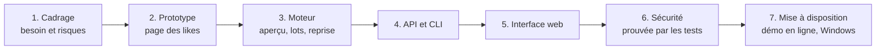
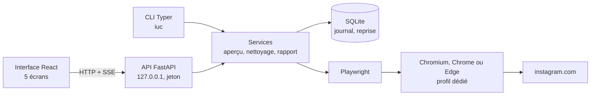
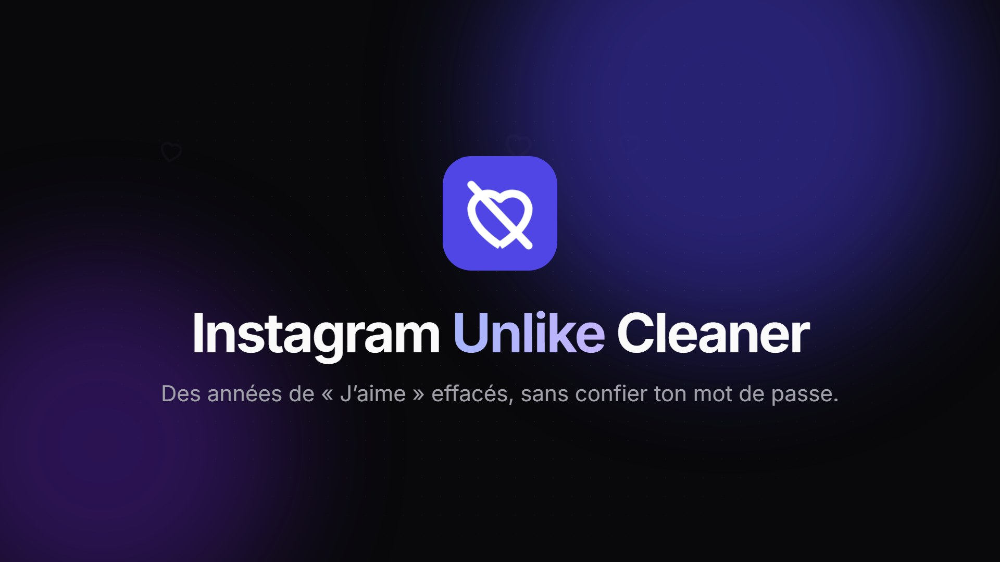
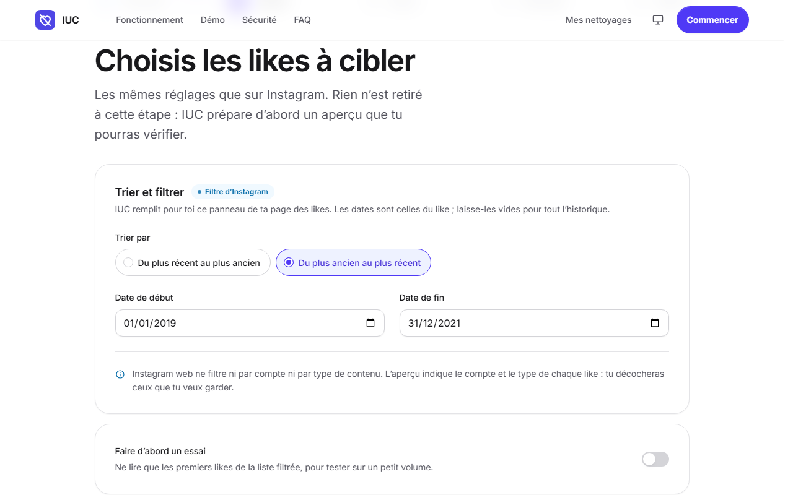
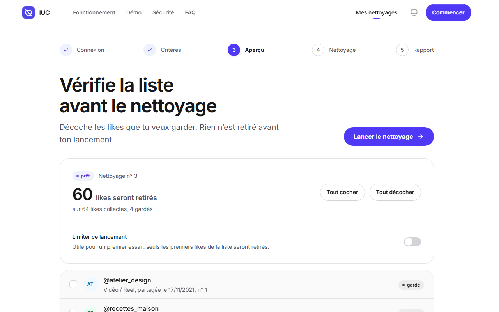
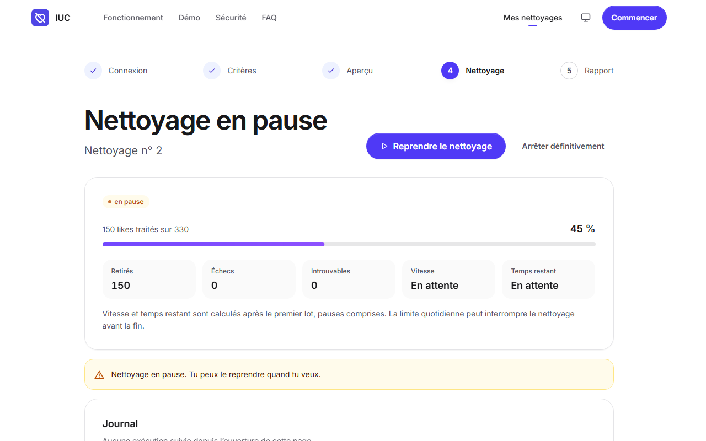
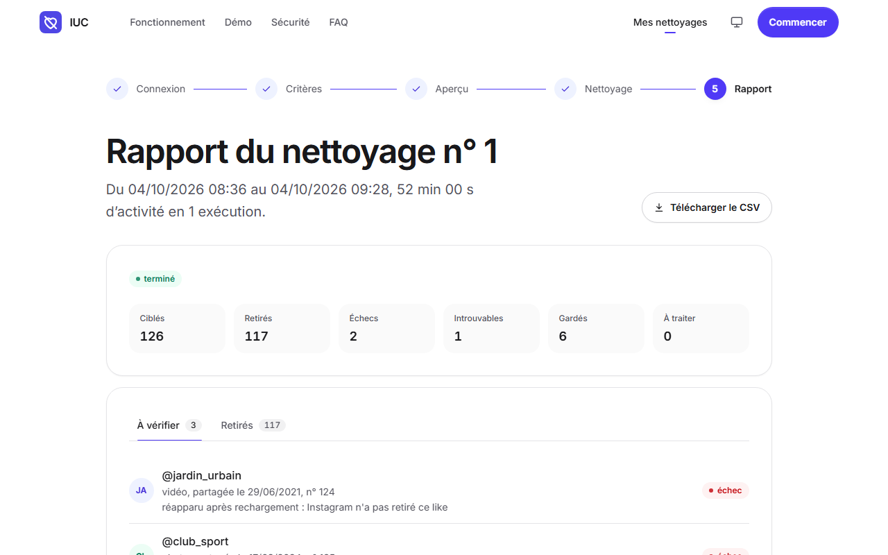
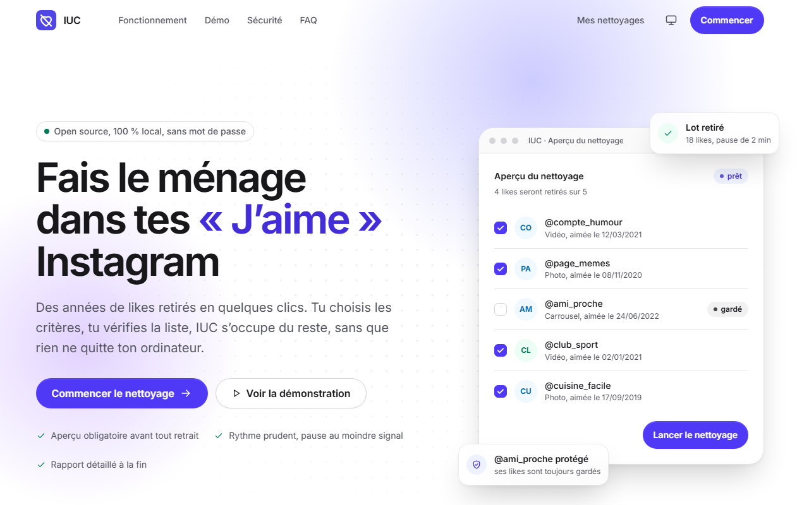
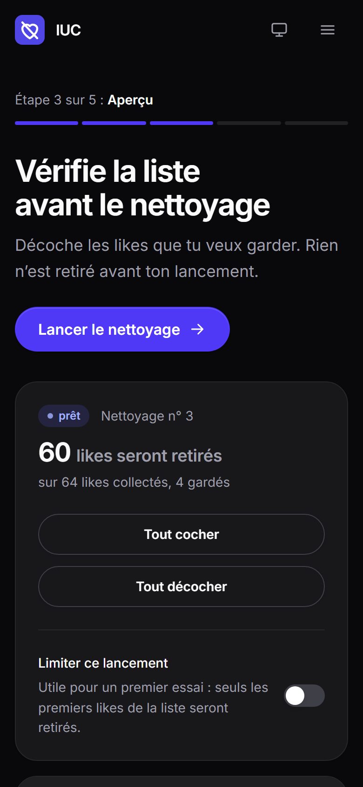

# Instagram Unlike Cleaner : effacer ses « J’aime » Instagram sans confier son compte


[](https://github.com/GomuGomuNo01/Instagram-Unlike-Cleaner/releases/latest)
[](https://github.com/GomuGomuNo01/Instagram-Unlike-Cleaner/actions/workflows/ci.yml?query=branch%3Amain)

Projet de bout en bout : un outil **100 % local** qui retire en masse les likes Instagram d’une
personne, après validation de chaque like ciblé, **sans jamais voir son mot de passe**. Essayé
sur un vrai compte (**1 493 likes recensés en 14 minutes**) et prouvé par **289 tests
automatisés**.

[](https://gomugomuno01.github.io/Instagram-Unlike-Cleaner/)
[](https://github.com/GomuGomuNo01/Instagram-Unlike-Cleaner/releases/latest/download/IUC-Setup.exe)
[](https://gomugomuno01.github.io/Instagram-Unlike-Cleaner/presentation)

*Présentation : l’application et son fonctionnement en 20 secondes de motion design, sur une
musique originale. Démo :
la vraie interface sur des likes fictifs, sans compte. Windows : installeur, ou
[version portable](https://github.com/GomuGomuNo01/Instagram-Unlike-Cleaner/releases/latest/download/IUC-portable.zip)
à lancer sans installation ; Chrome ou Edge requis. Notes de version sur la
[page des releases](https://github.com/GomuGomuNo01/Instagram-Unlike-Cleaner/releases/latest).*


*Le parcours en action, sur des données fictives : filtre d’Instagram, aperçu où l’on décoche ce
qu’on garde, nettoyage par lots suivi en direct, puis rapport.*

> **Avertissement** : les conditions d’utilisation d’Instagram **n’autorisent pas
> l’automatisation**. Utiliser IUC expose le compte à un blocage temporaire de certaines actions,
> voire, plus rarement, à une suspension. **Teste d’abord sur un compte secondaire**, avec de
> petits volumes. Retirer un like efface la trace visible, pas ce que l’algorithme a déjà appris.
> IUC est un projet indépendant, sans lien avec Instagram ni Meta.

---

## Sommaire

1. [Le projet en bref](#1-le-projet-en-bref)
2. [Les résultats](#2-les-résultats)
3. [Contexte et objectifs](#3-contexte-et-objectifs)
4. [Problématiques traitées](#4-problématiques-traitées)
5. [Données et confidentialité](#5-données-et-confidentialité)
6. [Outils et technologies](#6-outils-et-technologies)
7. [Méthodologie](#7-méthodologie)
8. [Étapes de réalisation](#8-étapes-de-réalisation)
9. [Le produit en images](#9-le-produit-en-images)
10. [Résultats détaillés](#10-résultats-détaillés)
11. [Conseils d'utilisation](#11-conseils-dutilisation)
12. [Principaux enseignements](#12-principaux-enseignements)
13. [Structure du projet](#13-structure-du-projet)
14. [Reproduire le projet](#14-reproduire-le-projet)
15. [Limites et pistes d'amélioration](#15-limites-et-pistes-damélioration)
16. [Contribuer, sécurité et licence](#16-contribuer-sécurité-et-licence)

---

## 1. Le projet en bref

> **En une phrase :** j’ai conçu et livré un outil qui fait gagner des heures à une personne
> voulant effacer ses likes Instagram, sans qu’elle ait à confier son mot de passe ni ses
> données à qui que ce soit.

### La situation

Des années de likes Instagram laissent une trace visible, parfois gênante au moment d’une
recherche de stage ou d’emploi. Instagram permet de les retirer, mais à la main, quelques-uns à
la fois. Les outils existants demandent souvent le mot de passe ou envoient les données à un
serveur tiers : on échange un problème de confidentialité contre un autre.

### Ce que j’ai fait

| Étape | En pratique |
|---|---|
| **Cadrer le besoin et les risques** | Aucun mot de passe, tout en local, aperçu obligatoire, cadence prudente, arrêt au moindre signal d’Instagram |
| **Valider la faisabilité** | Un prototype qui ouvre la page des likes dans un navigateur piloté, la personne s’y connectant elle-même |
| **Construire le moteur** | Ciblage par le filtre d’Instagram, retrait par lots contrôlés, journal en base pour reprendre sans rien retraiter |
| **Rendre l’outil utilisable** | Une interface web en cinq étapes (connexion, critères, aperçu, suivi, rapport) et une ligne de commande |
| **Prouver la sécurité** | Des tests qui vérifient chaque garantie, une intégration continue et des audits de dépendances |
| **Mettre à disposition** | Une démo en ligne sans installation, et une application Windows publiée (installeur ou version portable) |

### Ce que ce projet démontre

- **Sens du besoin** : partir d’une contrainte utilisateur forte (confidentialité) et en faire des
  règles vérifiables, inscrites dans le code et les tests.
- **Rigueur** : chaque action est contrôlée avant et après, chaque résultat est enregistré avant
  la suite, chaque garantie de sécurité a son test.
- **Esprit critique** : renoncer aux critères qu’Instagram ne permet pas de vérifier (compte, type
  de contenu) plutôt que de promettre un ciblage peu fiable.
- **Technique** : automatisation de navigateur, API locale sécurisée, base de données, interface
  web accessible, intégration continue, application Windows.
- **Communication** : une interface en français, claire, utilisable au clavier et sur mobile, et
  des messages qui disent toujours quoi faire.
- **Autonomie** : projet mené du cadrage à la publication d’une version, avec un historique de
  travail découpé par étapes.

### Pour découvrir le travail en 2 minutes

1. Essayer la [démo en ligne](https://gomugomuno01.github.io/Instagram-Unlike-Cleaner/), sans
   installation ni compte.
2. Lire [les résultats](#2-les-résultats) juste en dessous.
3. Parcourir [le produit en images](#9-le-produit-en-images).

## 2. Les résultats

**L’outil passe à l’échelle d’un vrai historique.** Sur un compte réel, **1 493 likes** ont été
recensés en **14 minutes**, puis retirés par lots à un rythme d’environ **25 likes par minute**,
pauses comprises.

**Rien n’est retiré par erreur.** Avant de cliquer sur « Je n’aime plus », IUC contrôle que les
cases cochées sont exactement celles du lot prévu ; après, il recharge la page. Un like qui
réapparaît est marqué en échec, jamais compté comme retiré.

**Le mot de passe ne passe jamais par IUC.** Des tests tapent de faux identifiants dans une
fausse page de connexion, puis les cherchent dans tous les fichiers produits : ils n’y sont pas.

**L’outil s’arrête au bon moment.** Déconnexion forcée, vérification de sécurité, message de
limite ou interface modifiée : le nettoyage s’arrête aussitôt, passe en pause et indique la
marche à suivre.

**N’importe qui peut l’essayer.** Démo en ligne pour découvrir, sans installation ni compte ;
application Windows (installeur ou portable) pour l’usage réel.

Le détail se trouve dans les sections [Résultats détaillés](#10-résultats-détaillés) et
[Étapes de réalisation](#8-étapes-de-réalisation).

## 3. Contexte et objectifs

**Le problème.** Une personne veut effacer des années de « J’aime » avant une recherche
d’emploi. Instagram web le permet, mais à la main, par petites sélections ; et confier son mot
de passe à un service tiers est exactement ce qu’elle veut éviter.

**Les objectifs** fixés au cadrage :

- **gagner du temps** : traiter des centaines ou des milliers de likes sans clic répétitif ;
- **garder la main** : un aperçu obligatoire, où l’on décoche ce que l’on veut garder ;
- **protéger la vie privée** : aucun mot de passe lu ni stocké, aucune donnée envoyée ailleurs
  que sur l’ordinateur de la personne ;
- **limiter le risque pour le compte** : cadence prudente, limite quotidienne, arrêt au moindre
  signal d’Instagram ;
- **rendre compte** : un rapport final de ce qui a été retiré, exportable.

Le cadrage complet (public, cas d’usage, risques, planning, architecture) est tenu dans deux
cahiers des charges, présentation et développeur, conservés hors du dépôt public.

## 4. Problématiques traitées

| # | Question | Réponse apportée |
|---|---|---|
| 1 | Comment retirer des centaines de likes sans clic répétitif ? | Retrait par lots de 20, avec pauses, jusqu’à la limite quotidienne |
| 2 | Comment ne jamais voir le mot de passe ? | Connexion faite par la personne dans une fenêtre de navigateur dédiée ; session reconnue au seul cookie |
| 3 | Comment cibler les bons likes ? | Le filtre d’Instagram, tel quel (tri, date de début, date de fin du like), puis un aperçu à décocher |
| 4 | Comment ne rien retirer par erreur ? | Contrôle de la sélection avant chaque lot, vérification au rechargement après |
| 5 | Comment limiter le risque pour le compte ? | Pauses aléatoires, limite quotidienne, arrêt immédiat sur alerte d’Instagram |
| 6 | Comment reprendre après une coupure ? | Chaque lot est écrit en base avant le suivant ; la reprise ne retraite rien |
| 7 | Comment le faire essayer facilement ? | Démo en ligne sans installation, application Windows à télécharger |

**Garantie centrale : rien n’est retiré sans validation de la personne.**

## 5. Données et confidentialité

| Élément | Détail |
|---|---|
| Source | La page « Votre activité › J’aime » d’Instagram, ouverte dans un navigateur piloté, sur le compte de la personne |
| Ce qui est lu | Pour chaque like : compte, type de publication, date de publication et nom de fichier de l’image (identifiant), tels qu’affichés dans la grille |
| Ce qui n’est jamais lu | Le mot de passe et tout champ du formulaire de connexion ; les diagnostics masquent toute saisie |
| Stockage | Tout dans un seul dossier local (`DATA_DIR`) : profil du navigateur, base SQLite, journaux, rapports |
| Exports | Rapport CSV (prêt pour Excel) et JSON de chaque nettoyage |
| Effacement | « Supprimer mes données locales » ou `iuc purge` |
| Démo et captures | Uniquement des comptes fictifs ; aucun compte réellement aimé dans le dépôt public, vérifié par un test |

Le backend n’ouvre aucune connexion réseau lui-même : seul le navigateur parle à Instagram, et
un test échoue si un module réseau apparaît dans son code.

## 6. Outils et technologies

| Outil | Utilisation dans le projet | Pourquoi ce choix |
|---|---|---|
| **Playwright** | Navigation, lecture de la grille, mode sélection | Profil persistant : la personne se connecte elle-même une fois, la session est reprise ensuite |
| **FastAPI**, Server-Sent Events | API locale, progression en direct | Schémas typés (OpenAPI) partagés avec le frontend ; flux d’événements simple pour le suivi |
| **SQLite**, SQLModel | Nettoyages, likes, journal, compteur quotidien | Une base locale sans serveur ; chaque lot est écrit avant le suivant |
| **Typer** | Ligne de commande `iuc` | Toutes les fonctions sans interface, utiles pour tester et diagnostiquer |
| **React 19**, TypeScript strict, Vite | Interface web | Client d’API typé depuis le schéma OpenAPI ; écrans chargés à la demande |
| **Tailwind CSS 4** | Système de design | Tokens (couleurs, typographie, espacements, motion) vérifiés par un test |
| **pytest, Vitest, Ruff, mypy, Oxlint** | Qualité | Lint, typage strict et tests à chaque modification |
| **GitHub Actions** | Intégration continue et publication | Python 3.11 et 3.14, audits des dépendances, démo et application publiées automatiquement |
| **GitHub Pages** | Démo en ligne | Gratuit, et aucun serveur du projet ne voit les données des utilisateurs |
| **PyInstaller, Inno Setup, pystray** | Application Windows | Installeur ou version portable ; IUC tourne sans fenêtre, piloté depuis la zone de notification |
| **Playwright, ffmpeg, numpy** | Vidéo de présentation | Animation CSS figée et capturée image par image, encodée en H.264 ; musique originale synthétisée note par note, calée sur les scènes |

## 7. Méthodologie



Trois principes ont guidé le travail :

1. **Partir du besoin et des risques**, pas de la technique : chaque fonctionnalité répond à
   une contrainte du cadrage (confidentialité, contrôle, prudence).
2. **Ne rien promettre qu’Instagram ne permet pas** : le prototype a montré que sa version web
   ne filtre que par tri et par dates ; IUC s’en tient à ce filtre, et l’aperçu fait le reste.
3. **Prouver chaque garantie** : chaque promesse de sécurité a un test qui échoue si elle est
   rompue.

## 8. Étapes de réalisation

### 8.1 Architecture



Un seul navigateur, piloté par Playwright, parle à Instagram ; l’API et la CLI passent par les
mêmes services.

### 8.2 Fonctionnement d’un nettoyage

| Étape | Rôle | Décisions techniques |
|---|---|---|
| Connexion | Fenêtre de navigateur dédiée, connexion manuelle | Session reconnue au seul cookie `sessionid` ; aucun champ lu ni rempli |
| Vérification | Ouverture de la page des likes | Chaque élément attendu est cherché ; s’il manque, le message le nomme |
| Critères | Filtre d’Instagram, et lui seul | IUC remplit le panneau « Trier et filtrer » (tri, date de début, date de fin) ; l’API refuse tout autre critère plutôt que de l’ignorer |
| Aperçu | Lecture complète de la grille filtrée | Chaque like est enregistré avec son compte et son type ; publications identifiées par le nom de fichier de leur image (aucun lien dans la grille) |
| Lot | Sélection, « Je n’aime plus », confirmation | Annulation si les cases cochées diffèrent du lot ; seule la fenêtre de confirmation attendue est validée |
| Contrôle | Rechargement de la page | Un like qui réapparaît passe en échec |
| Cadence | Pauses aléatoires, limite quotidienne | Entre deux cases, deux défilements et deux lots ; `DAILY_LIMIT` partagé entre nettoyages |
| Arrêt | Signal d’Instagram ou demande de la personne | Statut « en pause », reprise sans retraiter |
| Rapport | Bilan, export CSV et JSON | CSV prêt pour Excel (« ; », UTF-8 avec BOM) ; date et heure du retrait en deux colonnes |

### 8.3 Sécurité et confidentialité

Chaque garantie est appliquée dans le code et **prouvée par des tests**
([`test_security.py`](backend/tests/test_security.py), [`test_cleanup.py`](backend/tests/test_cleanup.py)).

| Sujet | Garantie | Preuve |
|---|---|---|
| Identifiants | Aucun champ de connexion lu ni rempli ; aucun mot de passe en mémoire, en base ou dans les journaux. Le navigateur n’enregistre aucun identifiant ; les diagnostics masquent toute saisie | Analyse du code, identifiants « témoins » cherchés dans tout `DATA_DIR` |
| Données locales | Tout dans `DATA_DIR` ; aucun appel réseau du backend ; CSP de l’interface limitée à l’API locale | Analyse des imports réseau, en-tête CSP, chemins de stockage |
| Suppression | `iuc logout`, `iuc purge` et le bouton « Supprimer mes données locales » | Tests de la CLI, de l’API et du service |
| Cadence | Délais aléatoires, plafond quotidien configurable | Tirages et bornes vérifiés |
| Alertes Instagram | Limite, vérification, déconnexion : arrêt immédiat, en pause, marche à suivre | Fausse page qui déconnecte, vérifie ou limite en plein nettoyage |
| Reprise | Chaque lot enregistré avant le suivant | Interruption, pause, limite puis reprise |
| Changement d’interface | Sélecteurs isolés ([`locators.py`](backend/app/browser/locators.py)), vérification au démarrage | Bouton absent, vignettes illisibles, bouton renommé |
| API locale | 127.0.0.1, jeton par démarrage, contrôle de l’hôte, CORS restreint, en-têtes de sécurité | Tests de l’API et de `iuc serve` |
| Dépendances | Versions figées ([`constraints.txt`](constraints.txt), `package-lock.json`), audits | `pip-audit` et `npm audit` sans vulnérabilité connue |
| Journaux | Aucun nom de compte aimé ni secret ; niveau réglable | Comptes « témoins » cherchés dans le journal |
| Dépôt public | Aucun compte réellement aimé dans les fichiers versionnés | Test de garde sur la base locale |

### 8.4 Tests et validation

| Niveau | Cible | Outil | Résultat |
|---|---|---|---|
| Unitaires | Filtre d’Instagram, limites quotidiennes, pauses aléatoires, machine d’états, exports | pytest | 235 tests serveur passés |
| Intégration | API et base SQLite, reprise après un arrêt | pytest, httpx | inclus ci-dessus |
| Automatisation | Navigation et retrait sur une fausse page des likes, réseau coupé | Playwright | inclus ci-dessus |
| Frontend | Composants, écran des critères, parcours principal, démo en ligne, présentation, tokens du système de design | Vitest, Testing Library | 54 tests passés |
| Application Windows | Démarrage réel d’`IUC.exe` avant chaque publication | GitHub Actions (Windows) | interface servie |
| Continu | Lint, typage, tests, audits | GitHub Actions | Python 3.11 et 3.14 |
| Manuel | Un lot réel sur un compte de test | [Recette](docs/recette.md) | 1 493 likes recensés, lots retirés et vérifiés |

La fausse page des likes ([`fake_instagram.py`](backend/tests/fake_instagram.py)) reproduit les
diagnostics réels : paquets de 18 vignettes, mode sélection, fenêtre de confirmation, filtres.

### 8.5 Mise à disposition

| Mode | Pour qui | Fonctionnement |
|---|---|---|
| [Démo en ligne](https://gomugomuno01.github.io/Instagram-Unlike-Cleaner/) | Visiteurs, recruteurs | La vraie interface, branchée sur une fausse API qui tourne dans le navigateur ([`frontend/src/demo`](frontend/src/demo)), sur des likes fictifs. Compilée à part : la vraie version n’en contient aucune ligne |
| [Application Windows](https://github.com/GomuGomuNo01/Instagram-Unlike-Cleaner/releases/latest) | Utilisateurs | Installeur ou version portable ([`packaging/`](packaging)), données dans `%LOCALAPPDATA%\IUC`, Chrome ou Edge déjà installés ; sans fenêtre, icône près de l’horloge |

Aucun mode ne fait passer de données par un serveur du projet : un tel serveur verrait les mots
de passe et les sessions Instagram des utilisateurs.

## 9. Le produit en images

▶ **[Essayer la démo en ligne](https://gomugomuno01.github.io/Instagram-Unlike-Cleaner/)**, ou
📥 **[télécharger IUC pour Windows](https://github.com/GomuGomuNo01/Instagram-Unlike-Cleaner/releases/latest/download/IUC-Setup.exe)**.

[](https://gomugomuno01.github.io/Instagram-Unlike-Cleaner/presentation)

*La présentation vidéo (20 s, 1080p, en musique) : cliquer pour la regarder dans l’onglet
« Présentation » de la démo. Elle est rendue image par image à partir d’une animation du dépôt
([`docs/video/presentation.html`](docs/video/presentation.html)), avec les écrans d’IUC ; sa
musique est composée et synthétisée pour elle ([`presentation_music.py`](scripts/presentation_music.py)),
calée sur chaque changement de scène, sans aucun droit à céder.*

| Écran | Contenu |
|---|---|
|  | **Critères** : le filtre d’Instagram, tel quel (trier par, date de début, date de fin du like), et un essai possible sur quelques likes |
|  | **Aperçu** : chaque like ciblé avec son compte et son type ; on décoche ce qu’on garde avant de lancer |
|  | **Suivi** : progression, vitesse, temps restant, journal en direct, pause et reprise |
|  | **Rapport** : bilan chiffré, likes à vérifier, export CSV et suppression des données locales |
|  | **Accueil** : présentation, démo interactive, sécurité et questions fréquentes |
|  | **Mobile et thème sombre** : la même interface, utilisable au clavier et sur petit écran |

*Toutes les captures utilisent des comptes fictifs ([`scripts/demo.py`](scripts/demo.py)).*

## 10. Résultats détaillés

### Essai sur un vrai compte

Sur un compte réel (recette manuelle, [`docs/recette.md`](docs/recette.md)) :

| Mesure | Résultat |
|---|---|
| Likes recensés dans la grille | 1 493 |
| Durée de la lecture complète | 14 minutes |
| Rythme de retrait | environ 25 likes par minute, pauses comprises |
| Likes retirés mais réapparus | marqués en échec, jamais comptés comme retirés |

### Robustesse face à Instagram

Chaque situation ci-dessous est reproduite sur la fausse page des likes, et IUC s’arrête sans
rien retirer de plus, en pause, avec la marche à suivre :

- déconnexion forcée ou demande de vérification de sécurité ;
- message « Réessayer plus tard » ou limite d’action ;
- fenêtre inconnue après « Je n’aime plus » ;
- bouton renommé ou élément introuvable (interface modifiée) ;
- likes encore affichés après « Je n’aime plus » : marqués en échec, jamais comptés comme retirés.

### Qualité du code

- **289 tests automatisés** : 235 côté serveur (dont l’automatisation sur la fausse page, réseau
  coupé), 54 côté interface.
- Lint et **typage strict** des deux côtés (Ruff, mypy, Oxlint, TypeScript) à chaque envoi.
- **Aucune vulnérabilité connue** dans les dépendances (`pip-audit`, `npm audit`), versions figées.
- Application Windows **démarrée réellement** par l’intégration continue avant chaque publication.

## 11. Conseils d'utilisation

| Priorité | Conseil | Pourquoi |
|---|---|---|
| 1 | **Tester d’abord sur un compte secondaire** | L’automatisation est contraire aux conditions d’utilisation d’Instagram |
| 2 | **Commencer par un essai** (« Faire d’abord un essai », « Limiter ce lancement ») | Vérifier sur quelques likes avant un gros volume |
| 3 | **Relire l’aperçu** et décocher ce que l’on garde | Instagram web ne filtre ni par compte ni par type : l’aperçu est l’endroit pour choisir |
| 4 | **Garder les réglages prudents** (`DAILY_LIMIT`, pauses) | Un gros historique s’étale sur plusieurs jours, ce qui limite le risque de blocage |
| 5 | **Respecter les arrêts** : attendre quelques heures après une alerte | IUC passe en pause pour une raison ; reprendre trop tôt augmente le risque |
| 6 | **Effacer ses données en fin d’usage** | « Supprimer mes données locales » supprime la session et l’historique d’IUC |

## 12. Principaux enseignements

**Sur l’automatisation d’une interface qu’on ne contrôle pas**
- La page des likes n’a ni liens ni identifiants : les publications sont reconnues au nom de
  fichier de leur image, et tous les sélecteurs sont isolés dans un seul module, vérifiés au
  démarrage.
- Un **prototype précoce** évite de construire sur des hypothèses fausses : c’est lui qui a
  montré que le filtre d’Instagram se limite au tri et aux dates.

**Sur la sécurité**
- **La sécurité se vérifie** : une revue a révélé que l’arbre d’accessibilité de Playwright
  recopie en clair la valeur des champs, mot de passe compris ; les diagnostics sont désormais
  expurgés, et un test échoue si la protection disparaît.
- **Tester sans le vrai service** : une fausse page des likes, fidèle aux diagnostics réels, sert à
  des centaines de tests, réseau coupé, pour qu’aucune requête ne parte sur Internet.

**Sur la mise à disposition**
- Faire essayer un outil local sans rien héberger est possible : une **fausse API dans le
  navigateur** pour la démo, une **application Windows** pour l’usage réel.
- Un détail d’usage compte : une date avec heure s’affiche « ##### » dans Excel ; la séparer en
  deux colonnes rend le rapport lisible dès l’ouverture.

## 13. Structure du projet

```
Instagram-Unlike-Cleaner/
├── README.md
├── LICENSE, CONTRIBUTING.md, SECURITY.md
├── backend/
│   ├── app/
│   │   ├── browser/          Navigateur : session, sélecteurs, grille, filtre d’Instagram, sélection
│   │   ├── services/         Aperçu, nettoyage, rapport, données locales
│   │   ├── api/              API locale (FastAPI) et sécurité
│   │   ├── core/             Configuration, base, journaux, protection des identifiants
│   │   ├── cli.py            Commandes iuc
│   │   ├── desktop.py        Point d’entrée de l’application Windows
│   │   └── tray.py           Icône de la zone de notification
│   └── tests/                Tests, dont la fausse version d’Instagram
├── frontend/                 Interface React (Vite, TypeScript, Tailwind)
│   └── src/demo/             Fausse API de la démo en ligne (likes fictifs, dans le navigateur)
├── scripts/                  demo.py (démonstration locale), render_presentation.py et
│                             presentation_music.py (vidéo et musique)
├── docs/                     Recette manuelle, page portfolio, images, animation de la vidéo
├── packaging/                Application Windows (PyInstaller, Inno Setup)
├── constraints.txt           Versions figées des dépendances Python
└── .github/workflows/        Intégration continue, démo en ligne, application Windows
```

## 14. Reproduire le projet

**Option 1 : application Windows (recommandé pour l’utiliser)**

1. Télécharger [`IUC-Setup.exe`](https://github.com/GomuGomuNo01/Instagram-Unlike-Cleaner/releases/latest/download/IUC-Setup.exe)
   (installeur, sans droits administrateur) ou
   [`IUC-portable.zip`](https://github.com/GomuGomuNo01/Instagram-Unlike-Cleaner/releases/latest/download/IUC-portable.zip)
   (sans installation : décompresser, puis lancer `IUC.exe`).
2. Si Windows affiche « Windows a protégé votre ordinateur » (IUC n’est pas signé, la signature
   est payante) : « Informations complémentaires », puis « Exécuter quand même ».
3. L’interface s’ouvre dans le navigateur. IUC tourne ensuite sans fenêtre : son icône, près de
   l’horloge, rouvre l’interface ou quitte IUC (un nettoyage en cours passe alors en pause).

Prérequis : Google Chrome ou Microsoft Edge. Données dans `%LOCALAPPDATA%\IUC`, gardées à la
désinstallation.

**Option 2 : depuis le code source**

Prérequis : Python 3.11 ou plus, Node.js 22 ou plus.

```bash
python -m venv .venv
.venv\Scripts\activate          # Windows ; sous macOS ou Linux : source .venv/bin/activate
pip install -e ".[dev]" -c constraints.txt
playwright install chromium
cd frontend && npm ci && npm run build && cd ..
iuc serve                       # interface sur http://127.0.0.1:8765, Ctrl+C pour arrêter
```

Sans compte Instagram : `python scripts/demo.py` sert l’interface sur `http://127.0.0.1:8799`
avec trois nettoyages fictifs ; `npm run build:demo` compile la démo en ligne. La vidéo de
présentation se régénère avec `pip install -e ".[video]" -c constraints.txt`, puis
`python scripts/render_presentation.py` (environ 4 minutes en 1080p) ; `--music-only` ne
remplace que la musique.

<details>
<summary><b>Commandes de la CLI</b></summary>

| Commande | Rôle |
|---|---|
| `iuc login` | Ouvre Instagram, attend la connexion, vérifie la page des likes |
| `iuc preview --start 2021-01-01 --end 2021-12-31 --oldest-first` | Prépare l’aperçu avec le filtre d’Instagram, sans rien retirer |
| `iuc jobs` | Liste les nettoyages et leur avancement |
| `iuc exclude 3 --rank 12 --author ami` | Garde des likes de l’aperçu, par rang ou par compte (`--restore` pour les remettre) |
| `iuc run 3 --limit 25` | Lance ou reprend le nettoyage n° 3 |
| `iuc stop 3` | Arrête définitivement un nettoyage |
| `iuc report 3` | Bilan et export CSV et JSON |
| `iuc probe` | Explore la page des likes sans rien retirer (diagnostics) |
| `iuc logout` / `iuc purge` | Supprime la session Instagram / toutes les données locales |

</details>

<details>
<summary><b>Configuration (fichier <code>.env</code>, voir <code>.env.example</code>)</b></summary>

| Variable | Défaut | Rôle |
|---|---|---|
| `DATA_DIR` | `./data` | Dossier de toutes les données locales |
| `DAILY_LIMIT` | `150` | Unlikes tentés par jour au maximum, tous nettoyages confondus |
| `DELAY_MIN`, `DELAY_MAX` | `4`, `12` | Pause aléatoire entre deux lots, en secondes |
| `BATCH_SIZE` | `20` | Likes retirés par lot |
| `LOG_LEVEL` | `INFO` | Niveau de détail des journaux |
| `API_PORT` | `8765` | Port de l’API locale (toujours sur 127.0.0.1) |
| `API_DOCS` | `false` | Page `/docs` de l’API, chargée depuis un CDN : à n’activer qu’en développement |
| `BROWSER_CHANNELS` | `["chromium"]` | Navigateurs essayés dans l’ordre : `chromium` (celui de Playwright), `chrome`, `msedge` ; `["chrome", "msedge"]` dans l’application Windows |

</details>

**Vérifier :**

```bash
pytest                                                   # -m "not browser" : sans Chromium
ruff check backend scripts && ruff format --check backend scripts && mypy
pip-audit -r constraints.txt --no-deps --disable-pip
cd frontend && npm test && npm run lint && npm run typecheck && npm run audit
```

## 15. Limites et pistes d'amélioration

**Limites**
- **Dépendance à l’interface d’Instagram** : une nouvelle version peut renommer un bouton. IUC
  s’arrête alors sans rien retirer et nomme l’élément manquant ; `iuc probe` aide à l’adapter.
- **Langue** : seule l’interface française est confirmée ; les libellés anglais restent à vérifier.
- **Ciblage limité au filtre d’Instagram** : sa version web ne filtre que par tri et par dates du
  like. Pas de critère par compte ni par type de contenu : un like à garder se décoche dans
  l’aperçu.
- **Dates** : la grille affiche la date de publication, pas celle du like ; seul le filtre
  d’Instagram connaît la date du like.
- **Volume** : la limite quotidienne (150 par défaut) étale un gros nettoyage sur plusieurs jours,
  par prudence.
- **Application non signée** : Windows affiche un avertissement au premier lancement.
- **Risque de compte** : l’automatisation reste contraire aux conditions d’utilisation
  d’Instagram, quelles que soient les précautions.

**Pistes d’amélioration**
- Confirmer et compléter les libellés anglais de l’interface d’Instagram.
- Importer l’export officiel des données Instagram (`liked_posts.json`) pour préparer l’aperçu
  sans parcourir la grille.
- Traduire l’interface d’IUC en anglais (le vocabulaire est déjà centralisé).
- Publier une application pour macOS, et signer l’application Windows.

## 16. Contribuer, sécurité et licence

| Document | Contenu |
|---|---|
| [CONTRIBUTING.md](CONTRIBUTING.md) | Installation pour le développement, règles, adaptation à Instagram |
| [SECURITY.md](SECURITY.md) | Signalement privé d’une vulnérabilité |
| [Recette manuelle](docs/recette.md) | Essai réel pas à pas sur un compte de test |
| [Page portfolio](docs/portfolio.md) | Problème, réponse, résultat et enseignements |

- Contributions : voir [CONTRIBUTING.md](CONTRIBUTING.md).
- Vulnérabilité : signalement privé, voir [SECURITY.md](SECURITY.md).
- Licence : [MIT](LICENSE). Instagram est une marque de Meta Platforms, Inc.

**Auteur :** Dibie Elisee Jules Cedric KOUADIO ([@GomuGomuNo01](https://github.com/GomuGomuNo01))
